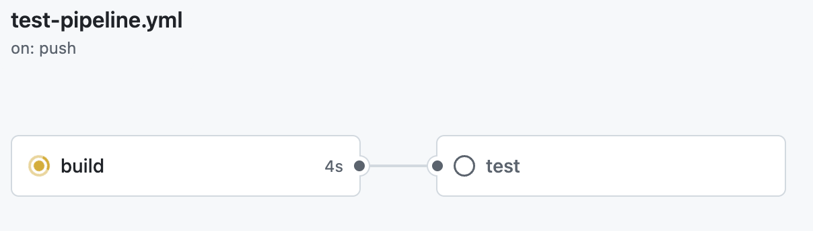

# CD/CD, Git/GitHub Flow

На прошлой лекции мы обсудили, что такое git и как с ним работать. Наверняка вы знаете про GitHub/GitLab/etc.,
на этой лекции обсудим что помимо обычного git'а они позволяют использовать и делать, и какие есть методы ведения
проектов.

# Git/GitHub Flow

## Git Flow

Git Flow - это один из самых популярных подходов к организации работы с Git в проекте.

Основная идея в том, что есть несколько типов веток, каждая из которых служит своей цели:
- `main` (или `master`) - главная ветка, в которой всегда находится стабильная, готовая к релизу версия проекта.
- `develop` - основная ветка для разработки. Все новые функции и исправления сначала попадают сюда.
- `feature/` - ветки для реализации отдельных функций или задач. Обычно создаются из ветки develop и после завершения работы вливаются обратно.
- `release/` - ветки для подготовки релиза. Из develop создаётся ветка `release/x.y.z`, где происходит финальная отладка и исправление багов перед выпуском.
- `hotfix/` - ветки для срочных исправлений продакшен-версии. Создаются из main и после завершения сливаются обратно и в main, и в develop.


Такой подход даёт больший контроль в больших командах, где изменения в кодовую базу вносятся часто. Ветки типа `release/` возволяют строго контролировать его содержимое, вероятность что "лишний" коммит в нём окажется низкий. Также это свойство позволяет проводить более качественное тестирование.

Git Flow особенно удобен для сервисов, которые разворачиваются на серверах пользователей ([on-premise](https://en.wikipedia.org/wiki/On-premises_software)), так как создавать релизы в таких случаях очень "дорого": необходимо их уведомить, и они сами должны раскатить его на свою инфраструктуру.

Ветки чётко разделяют стадии разработки, это повышает прозрачность процессов, но одновременно с этим может запутать и привносит бюрократию (?).

Суммируя, основные плюсы и минусы этого подхода примерно следующие:

Плюсы
- Позволяет чётко разделять этапы разработки
- Удобен для версионирования и выпуска релизов
- Безопасен: стабильная версия кода всегда отделена от рабочей

Минусы
- Избыточен для небольших проектов
- Требует дисциплины и понимания процесса всеми участниками

p.s.

Как правило есть хотя бы один коллега, который либо не понимает gitflow, либо просто игнорирует его, и получаются ветки "faeture/...", "patch-do-something", etc., очень редко когда получается "красивый" git flow

## GitHub Flow

GitHub Flow - это более простой и современный подход, появившийся как альтернатива Git Flow.
Он подходит для проектов, где релизы происходят часто, а выкатывание изменений (деплой) максимально автоматизировано.

Основная идея - работать с одной основной веткой (`main`), которая всегда находится в актуальном состоянии, и временными ветками для отдельных задач.

Пример типичного процесса:
- Создаётся новая ветка от main, например `feature/add-login`.
- В ней ведётся работа над задачей - можно делать сколько угодно коммитов.
- После завершения работы открывается Pull Request или Merge Request - запрос на слияние изменений обратно в `main`
- Коллеги просматривают код (code review), оставляют комментарии, правки.
- После одобрения ветка сливается в main, и CI/CD автоматически запускает тесты и деплой.


Главная философия GitHub Flow - частые, небольшие изменения, которые легко проверять, откатывать и выпускать.
Благодаря этому подходу можно выкатить обновление хоть несколько раз в день, не создавая громоздких релизов.

GitHub Flow часто используют стартапы, небольшие команды или проекты с непрерывной интеграцией и деплоем (CI/CD).
Он делает процесс разработки проще, но требует хороших автоматических тестов - без них легко что-то поломать.
Особенно удобен для [SaaS](https://en.wikipedia.org/wiki/Software_as_a_service).

Плюсы:
- Простая и понятная схема
- Подходит для частых релизов и непрерывной интеграции
- Минимум бюрократии - меньше веток, меньше ритуалов

Минусы:
- Нет отдельной ветки для разработки - вся надежда на тесты и code review
- Для крупных проектов со сложным релизным циклом может быть слишком «плоским»
- Требует настроенного CI/CD, иначе смысл теряется

p.s.

С github flow **очень** важны автоматизированные тесты, причём качественные и многочисленные, иначе рано или поздно критическая ошибка попадёт в релиз.
В следующем разделе поговорим о CI/CD - способе автоматизировать тесты, деплой приложений и другие процессы разработки.

# CI/CD

Если Git нужен для того, чтобы контролировать изменения кода, то CI/CD - это про то, как эти изменения попадают в реальный мир.

Главная цель CI/CD - автоматизировать всё, что только можно в процессе разработки: от сборки и тестов до выкатывания приложения в продакшен.

## CI

Continuous Integration (непрерывная интеграция) - это практика, при которой разработчики как можно чаще (в идеале - после каждой небольшой задачи) заливают изменения в общий репозиторий.
После каждого пуша запускаются автоматические проверки: сборка, тесты, [линтеры](https://habr.com/ru/companies/oleg-bunin/articles/433480/) и т.д.
Это необходимо, чтобы удостовериться что новый код не "ломает" старый, и что сервис по-прежнему находится в работоспособном состоянии.

Типичный пайплайн CI может включать шаги:

- Сборка - установка зависимостей, сборка проекта (например, `npm install && npm run build`, `./gradlew test` и т.д.)
- Тестирование - прогон unit-тестов, интеграционных тестов и т.п.
- Статический анализ - линтеры, проверки кода на стиль, безопасность и уязвимости
- Создание артефактов - например, собранные бинарники, контейнеры или пакеты, которые можно передавать дальше

Если на каком-то этапе что-то падает - пайплайн останавливается, и разработчик сразу узнаёт об ошибке (как правило запрос на слияние блокируется, слить изменения нельзя).

## CD

CD - это следующий логический шаг.

После того, как всё собрано и протестировано, проект можно:

- либо доставить (Continuous Delivery) - т.е. подготовить к деплою, но без автоматического выкатывания,
- либо развернуть (Continuous Deployment) - автоматически выкатить изменения на нужное окружение (например, staging или production).

Типичный CD-пайплайн может делать следующее:

- Создавать тег в Git с номером версии (например, v1.3.0)
- Собирать Docker-образ и пушить его в registry
- Обновлять staging-окружение
- При необходимости - автоматически деплоить в production
- Присылать уведомления в Slack/Telegram о том, что всё прошло успешно

## CI/CD в GitHub

GitHub Actions - это встроенная система автоматизации, которая позволяет выполнять любые действия при событиях в репозитории: от запуска тестов до публикации релизов и деплоя в продакшен.

Если Git - это "история изменений", а CI/CD - “процесс сборки и доставки”, то Actions - это "клей" между ними.

GitHub Actions работает по принципу событие -> задание -> шаги. Разработчик задаёт по какому событию сервиса что нужно делать и каким образом.

Все actions описываются при помощи файлов [yaml](https://yaml.org) в директории `.github/workflows/`.

Каждый .yml-файл - это workflow (рабочий процесс), который GitHub запускает автоматически при наступлении определённых событий.

Разберём пример такого файла:

```yaml
name: CI

on: [push, pull_request]

jobs:
  build:
    runs-on: ubuntu-latest

    steps:
      - uses: actions/checkout@v4
      - name: Install dependencies
        run: npm ci
      - name: Run tests
        run: npm test
```

- name - имя пайплайна (будет отображаться в интерфейсе GitHub).
- on - события, которые запускают этот workflow (в данном случае: push и pull_request).
- jobs - список заданий, которые нужно выполнить.
- runs-on - среда, где запускается job (например, ubuntu-latest, windows-latest, macos-latest).
- steps - конкретные команды или действия.

Каждая команда или действие выполняют либо специальную готовую операцию - например, `actions/checkout@v4` выполняет команду `git checkout` -, либо выполняет заданную команду, например, `npm test`.

Workflow может содержать несколько заданий, которые выполняются параллельно или последовательно.
Например, следующий код выполнит две задачи: сначала build, потом - test. Причём задача test начнёт выполняться только после успешного выполнения задачи build.

```yaml
run-name: Testing our repository
on: [push]
jobs:
  build:
    runs-on: ubuntu-latest
    steps:
      - uses: actions/checkout@v4
      - run: make build

  test:
    runs-on: ubuntu-latest
    needs: build
    steps:
      - uses: actions/checkout@v4
      - run: make test
```

В интерфейсе GitHub будет выглядеть следующим образом:



p.s.
Советую ознакомиться с yaml, он ОЧЕНЬ часто встречается в разработке для конфигураций, описания архитектуры ([kubernetes](https://habr.com/ru/articles/258443/)), CI/CD и много где ещё

# Дополнительные материалы

Говоря про версии, сложно не затронуть хоть какую-то конвенцию по их наименованию. Очень советую почитать про [Semantic Versioning](https://semver.org/) и почитать неплохую [статью на википедии](https://en.wikipedia.org/wiki/Software_versioning) про версии в разработке.

GitHub Actions это очень мощный инструмент, печально что наш курс такой короткий, и мы не можем углубиться в него, поэтому советую почитать про него в [официальной документации](https://github.com/features/actions) + есть большой маркетплейс с очень удобными инструментами для actions: https://github.com/marketplace

В Gitlab тоже есть свой ci/cd, и в каком-то смысле он является стандартом в индустрии: если пойдёте работать, то 99% увидете гитлаб. Было бы здорово почитать про него и уметь им пользоваться: https://docs.gitlab.com/ci
