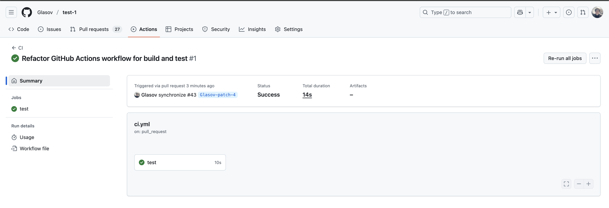

# Лаба 2 - CI/CD
На лекции мы узнали, что такое CI/CD, зачем он нужен и как его можно настроить с помощью GitHub Actions.

В этой лабораторной работе попробуем на практике создать собственный CI/CD-пайплайн: он будет автоматически запускать тесты, собирать проект и создавать релизы при новых версиях.

# Что нужно сделать
1. Подготовить репозиторий (можно склонировать репозиторий test-1 из первой лабораторной)
2. Создать CI-пайплайн для проверки кода
3. Настроить CD: автоматическую публикацию при создании тега

Сдать ссылку на репозиторий с работающими Actions

# Содержание

## 1. Подготовка
Создаём или клонируем репозиторий из первой лабораторной и создаём два файла:

*main.py*
```python
def hello():
    return "Hello, CI/CD!"
```

*test_main.py*
```python
from main import hello

def test_hello():
    assert hello() == "Hello, CI/CD!"
```

## 2. Настройка CI

Создайте в репозитории директорию `.github/workflows/` и внутри неё файл `ci.yml`:

```yaml
name: CI

on:
  push:
    branches: [ main ]
  pull_request:

jobs:
  test:
    runs-on: ubuntu-latest

    steps:
      - name: Checkout code
        uses: actions/checkout@v4

      - name: Set up Python
        uses: actions/setup-python@v5
        with:
          python-version: '3.12'

      - name: Install dependencies
        run: pip install pytest

      - name: Run tests
        run: pytest
```

В нём мы запускаем тестирование нашего проекта при помощи библиотеки [pytest](https://docs.pytest.org/en/stable).

Теперь при каждом коммите в `main` ветку или создании любого PR будет запускаться наш пайплайн.

Мы можем увидеть его во вкладке "Actions":


При переходе в него можем увидеть джобы (job), а при нажатии на любую из них - действия (steps), которые были выполнены в её рамках.




## 3. Настройка CD

Теперь сделаем, чтобы при создании нового тега (например, v1.0.0) GitHub автоматически создавал релиз.

Добавим новый файл `.github/workflows/release.yml`:

```yaml
name: Release

on:
  push:
    tags:
      - 'v*.*.*'

jobs:
  release:
    runs-on: ubuntu-latest
    steps:
      - name: Checkout
        uses: actions/checkout@v4

      - name: Build project
        run: echo "Собираем проект..."

      - name: Create GitHub Release
        uses: softprops/action-gh-release@v2
        with:
          name: Release ${{ github.ref_name }}
          body: Автоматический релиз новой версии
```

Теперь при создании тега вида `v*.*.*` будет автоматически создаваться релиз.
